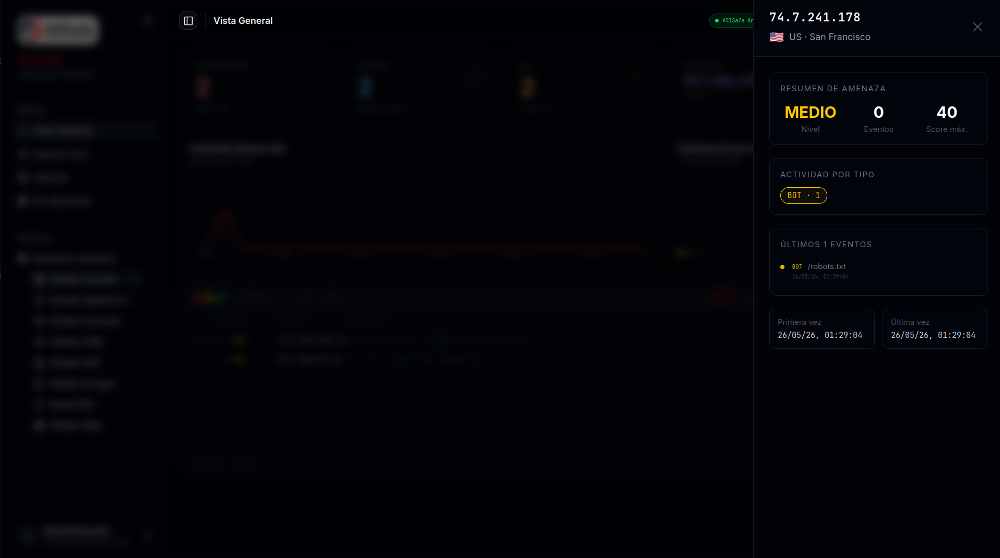

[](README.md)

<div align="center">
  

  # Heimdall Community - Monitor de Honeypot Web

  **Plataforma de honeypot web en tiempo real - libre y open source**

  *Powered by [AllSafe Security Solutions](https://www.allsafe.com.ar)*

  
  
  
  
  

  [](https://allsafe.com.ar/heimdall-community/)
</div>

---

Heimdall Community es una plataforma de honeypot web libre y open source con dashboard en tiempo real. Despliega servicios falsos (portales de login, paneles de administración, APIs) que registran cada interacción - intentos de fuerza bruta, escáneres, bots e intrusos humanos - siendo completamente invisible para el tráfico legítimo.

> El nombre viene de Heimdall - el dios Aesir que guarda el puente Bifrost en la mitología nórdica. Todo lo ve y todo lo escucha, sin dormir jamás.

---

## ¿Qué es Heimdall Community?

Heimdall Community le da a tu Blue Team visibilidad total sobre quién está sondeando tu infraestructura:

- **4 templates de honeypot** - WordPress, cPanel, Portal Corporativo, Microsoft
- **Señuelos HTTP y HTTPS** - Puertos 80 y 443 con soporte de certificado autofirmado
- **Scoring de amenazas** - Cada evento recibe una clasificación de riesgo: BRUTE / SCAN / BOT / RECON / HUMAN
- **Dashboard en tiempo real** - Feed de eventos en vivo via WebSocket con pause/resume sin perder eventos
- **Lista de IPs** - Vista agregada de IPs atacantes con conteo de hits y geolocalización
- **Historial de eventos** - Tabla paginada con filtros por tipo
- **Estadísticas** - Total de eventos, IPs únicas, top atacantes, breakdown por tipo de ataque
- **Control de acceso por roles** - `admin` / `viewer`
- **Gestión de usuarios** - Crear, editar, habilitar/deshabilitar usuarios
- **TOTP 2FA** - RFC 6238, configuración via código QR
- **Tema Dark / Light / Sistema**

> ¿Buscás **más templates de honeypot**, un **constructor de templates personalizados**, **puertos trampa TCP** (detección de nmap/masscan/zgrab), el **IP Profiler** o **audit logs**? Esas funcionalidades están en [Heimdall Pro](https://www.allsafe.com.ar).

---

## Community vs Pro

| Funcionalidad | Community | Pro |
|---|:---:|:---:|
| Señuelos HTTP y HTTPS (puertos 80 / 443) | ✅ | ✅ |
| Dashboard en tiempo real (WebSocket) | ✅ | ✅ |
| Scoring de amenazas (BRUTE / SCAN / BOT / RECON / HUMAN) | ✅ | ✅ |
| Historial de eventos, estadísticas y geolocalización de IPs | ✅ | ✅ |
| TOTP 2FA + lockout de cuenta | ✅ | ✅ |
| Tema Dark / Light / Sistema | ✅ | ✅ |
| Templates de honeypot | 4 | 8+ |
| Constructor de templates (logo / colores / textos) | ❌ | ✅ |
| Puertos trampa TCP (detección nmap / masscan / zgrab) | ❌ | ✅ |
| Clasificación PORTSCAN | ❌ | ✅ |
| IP Profiler (timeline de ataque y nivel de amenaza por IP) | ❌ | ✅ |
| Audit log | ❌ | ✅ |
| Branding personalizado (logo de organización) | ❌ | ✅ |
| Roles | `admin` / `viewer` | `admin` / `analista` / `auditor` / `viewer` |

> **Upgrade path**: Community y Pro comparten el mismo esquema de base de datos. Actualizar = reemplazar archivos + `npm install` + `pm2 restart`. Sin migraciones.

---

## Screenshots

<div align="center">

**Dashboard en tiempo real**
<br/>


<br/><br/>

**Historial de eventos**
<br/>


<br/><br/>

**Perfil de IP atacante**
<br/>


</div>

---

## Instalación

### Opción A - Script de instalación (recomendado para servidores Linux)

```bash
git clone https://github.com/allsafe-ar/heimdall-community.git
cd heimdall-community
chmod +x install.sh && sudo ./install.sh
```

Probado en Ubuntu 22.04 / 24.04 y Debian 12.

### Opción B - Docker

```bash
git clone https://github.com/allsafe-ar/heimdall-community.git
cd heimdall-community
cp .env.example .env
# Editar .env: definir DB_PASSWORD, DB_ROOT_PASSWORD y JWT_SECRET (openssl rand -hex 32)
docker compose up -d
```

### Opción C - Manual

```bash
# Backend
cd backend
npm install
cp .env.example .env
# Editar .env: credenciales DB + JWT_SECRET fuerte (mín. 32 caracteres)
npm start   # puerto 3005

# Frontend
cd frontend
npm install
npm run build   # Build de producción → dist/
```

Credenciales por defecto (primer arranque): `admin` / `admin123` - **cambiar inmediatamente**.

---

## Arquitectura

```
heimdall-community/
├── backend/
│   ├── server.js       # Backend en un solo archivo - motor honeypot + REST API + WebSocket
│   ├── templates/      # Páginas HTML señuelo servidas como honeypots
│   └── .env.example
└── frontend/
    └── src/
        ├── pages/      # Dashboard, Eventos, IPs, Usuarios, Mi Cuenta
        ├── components/ # StatsBar, TerminalCard, EventTable, IpListView, ...
        └── lib/        # socket, api, cookies
```

### Backend

- Servidor Express en un solo archivo (`server.js`)
- MySQL 8.0+ - tablas creadas automáticamente en el primer arranque
- Autenticación JWT (expiración 12h), TOTP 2FA, lockout de cuentas
- WebSocket (Socket.IO) para streaming de eventos en vivo
- Motor honeypot: captura IP, User-Agent, path, método, body - asigna threat score
- Rate limiting: 5 intentos fallidos → lockout 15 min; 300 req/15 min por IP

### Frontend

- React 18 + Vite + TypeScript
- Componentes shadcn/ui + Tailwind CSS v4
- Feed en tiempo real con tope de 2000 eventos en memoria
- Pause/resume del feed sin perder eventos (buffer interno)

---

## Templates de Honeypot

| Template | Simula |
|----------|--------|
| `generic` | Portal Corporativo - login de empleados |
| `wordpress` | Login de WordPress wp-admin |
| `cpanel` | Panel de hosting cPanel |
| `microsoft` | Inicio de sesión con cuenta Microsoft |

El template activo se puede cambiar desde el dashboard sin reiniciar.

---

## Clasificación de Amenazas

| Tipo | Descripción |
|------|-------------|
| `BRUTE` | Intentos repetidos de login - credential stuffing o fuerza bruta |
| `SCAN` | Enumeración de paths / escaneo de vulnerabilidades |
| `BOT` | Bot automatizado - scraping o sondeo |
| `RECON` | Reconocimiento - recopilación de información |
| `HUMAN` | Interacción manual probable |

---

## Roles

| Rol | Capacidades |
|-----|-------------|
| `admin` | Acceso completo - usuarios, configuración, todos los eventos |
| `viewer` | Dashboard - vista de solo lectura de eventos y estadísticas |

---

## Seguridad & Auth

Los endpoints señuelo del honeypot están abiertos a propósito — esa es justamente la idea — pero el **dashboard y la API de gestión están blindados** con la misma base de hardening que la suite comercial de AllSafe:

- **JWT** — expiración 12h con revocación por `token_version` al cambiar contraseña o deshabilitar usuario
- **TOTP 2FA** — RFC 6238, setup via código QR
- **Lockout de cuenta** — 5 intentos fallidos → bloqueo de 15 minutos, **persistido en la base de datos** (sobrevive reinicios)
- **bcrypt** para el hashing de contraseñas (salt por usuario)
- **Headers de seguridad** (Helmet) + **rate limiting HTTP** — 300 req/15 min en la API, endpoints de auth limitados a 10/15 min
- **Control de acceso por rol** — `admin` / `viewer`
- **SQL 100% parametrizado** — sin queries armadas por concatenación, sin vectores de inyección (OWASP Top 10 2021)
- **Arranque fail-fast** — el backend no inicia con un `JWT_SECRET` ausente, por defecto o demasiado corto
- **CORS** restringido al origen configurado (sin comodín)

---

## Roadmap

- Honeypot SSH (puerto 22, estilo cowrie) con logging de comandos
- Shell falsa interactiva por Telnet
- Alertas por email / webhook cuando el score supera un umbral
- Exportación de eventos CSV / JSON
- Mapa de calor geográfico de ataques
- Blacklist automática de IPs via iptables

---

## Autor

Creado por **Eduardo Emiliano Alaniz** ([@h4wkby73](https://github.com/h4wkby73))
[AllSafe Security Solutions](https://www.allsafe.com.ar)

---

## Aviso de Marca Registrada

Los nombres "AllSafe", "AllSafe Security Solutions", "Heimdall" y todos los logos asociados son marcas comerciales de AllSafe Security Solutions. La licencia AGPL-3.0 que cubre este software no otorga ningun derecho sobre estas marcas o logos. No podés usarlos para identificar, respaldar ni promover productos derivados de este software sin autorización previa y por escrito de AllSafe Security Solutions.

---

## Licencia

GNU Affero General Public License v3.0 - ver archivo [LICENSE](LICENSE).

Si modificás y desplegás Heimdall Community como servicio, debés publicar tus modificaciones bajo la misma licencia.

---

## Seguridad

¿Encontraste una vulnerabilidad? Reportala de forma privada - ver [SECURITY.md](SECURITY.md).

---

<div align="center">
  <sub>Powered by <a href="https://www.allsafe.com.ar">AllSafe Security Solutions</a></sub>
</div>
