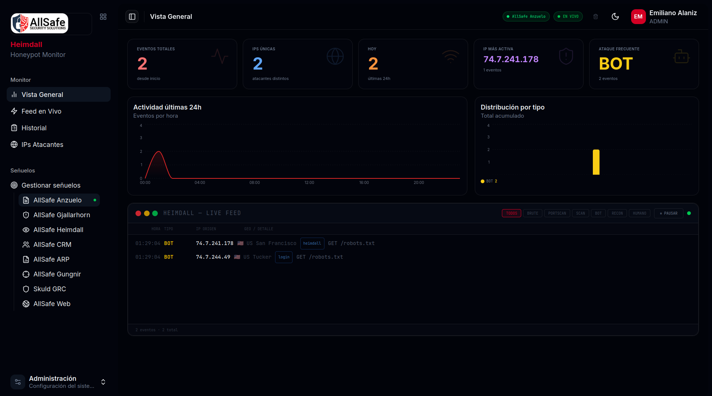
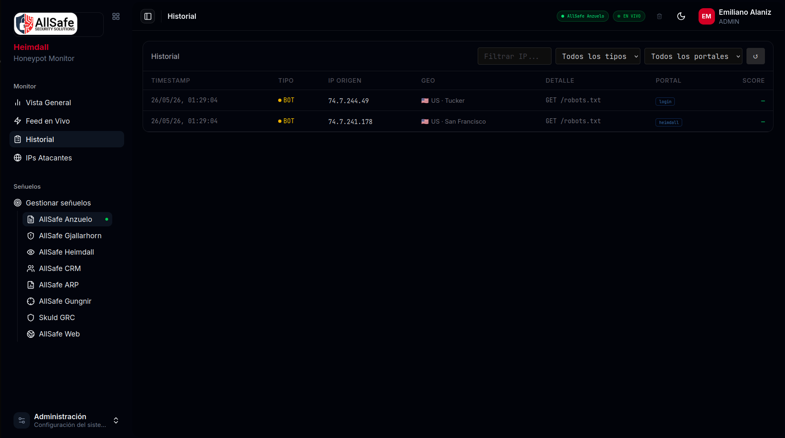

[](README.es.md)

<div align="center">
  

  # Heimdall Community - Web Honeypot Monitor

  **Real-time web honeypot platform - free and open source**

  *Powered by [AllSafe Security Solutions](https://www.allsafe.com.ar)*

  
  
  
  
  
</div>

---

Heimdall Community is a free, open-source web honeypot platform with a real-time dashboard. It deploys fake services (login portals, admin panels, APIs) that log every interaction - brute-force attempts, scanners, bots, and human intruders - while remaining completely invisible to legitimate traffic.

> The name comes from Heimdall - the Aesir god who guards the Bifrost bridge in Norse mythology. He sees all and hears all, never sleeping.

---

## What is Heimdall Community?

Heimdall Community gives your Blue Team full visibility over who is probing your infrastructure:

- **4 honeypot templates** - WordPress, cPanel, CorpNet Portal, Microsoft
- **HTTP & HTTPS decoys** - Ports 80 and 443 with self-signed certificate support
- **Threat scoring** - Each event gets a risk classification: BRUTE / SCAN / BOT / RECON / HUMAN
- **Real-time dashboard** - Live event feed via WebSocket with pause/resume without missing events
- **IP list** - Aggregated view of attacking IPs with hit counts and geolocation
- **Event history** - Paginated table with filter by type
- **Statistics** - Total events, unique IPs, top attackers, attack breakdown by type
- **Role-based access** - `admin` / `viewer`
- **User management** - Create, edit, enable/disable users
- **TOTP 2FA** - RFC 6238, setup via QR code
- **Dark / Light / System theme**

---

## Screenshots

<div align="center">

**Real-time Dashboard**
<br/>


<br/><br/>

**Event History**
<br/>


</div>

---

## Installation

### Option A - Install script (recommended for Linux servers)

```bash
git clone https://github.com/allsafe-ar/heimdall-community.git
cd heimdall-community
chmod +x install.sh && sudo ./install.sh
```

Tested on Ubuntu 22.04 / 24.04 and Debian 12.

### Option B - Docker

```bash
git clone https://github.com/allsafe-ar/heimdall-community.git
cd heimdall-community
cp backend/.env.example backend/.env
# Edit backend/.env: set DB_PASSWORD and JWT_SECRET
docker compose up -d
```

### Option C - Manual

```bash
# Backend
cd backend
npm install
cp .env.example .env
# Edit .env: DB credentials + strong JWT_SECRET (min 32 chars)
npm start   # port 3005

# Frontend
cd frontend
npm install
npm run build   # Production build → dist/
```

Default credentials (first run): `admin` / `admin123` - **change immediately**.

---

## Architecture

```
heimdall-community/
├── backend/
│   ├── server.js       # Single-file backend - honeypot engine + REST API + WebSocket
│   ├── templates/      # HTML decoy pages served as honeypots
│   └── .env.example
└── frontend/
    └── src/
        ├── pages/      # Dashboard, Events, IPs, Users, My Account
        ├── components/ # StatsBar, TerminalCard, EventTable, IpListView, ...
        └── lib/        # socket, api, cookies
```

### Backend

- Single-file Express server (`server.js`)
- MySQL 8.0+ - tables auto-created on first start
- JWT authentication (12h expiry), TOTP 2FA, account lockout
- WebSocket (Socket.IO) for live event streaming
- Honeypot engine: captures IP, User-Agent, path, method, body - assigns threat score
- Rate limiting: 5 failed logins → 15-min lockout; 300 req/15 min per IP

### Frontend

- React 18 + Vite + TypeScript
- shadcn/ui components + Tailwind CSS v4
- Real-time feed capped at 2000 events in memory
- Pause/resume live feed without losing events (internal buffer)

---

## Honeypot Templates

| Template | Simulates |
|----------|-----------|
| `generic` | CorpNet Portal - corporate employee login |
| `wordpress` | WordPress wp-admin login |
| `cpanel` | cPanel hosting panel |
| `microsoft` | Microsoft account login |

The active template is switchable from the dashboard without restart.

---

## Threat Classification

| Type | Description |
|------|-------------|
| `BRUTE` | Repeated login attempts - credential stuffing or brute force |
| `SCAN` | Path enumeration / vulnerability scanning |
| `BOT` | Automated bot - scraping or probing |
| `RECON` | Reconnaissance - info gathering |
| `HUMAN` | Likely manual interaction |

---

## Roles

| Role | Capabilities |
|------|-------------|
| `admin` | Full access - users, settings, all events |
| `viewer` | Dashboard - read-only view of events and stats |

---

## Roadmap

- SSH honeypot (port 22, cowrie-style) with command logging
- Interactive Telnet fake shell
- Email / webhook alerts when score exceeds threshold
- CSV / JSON event export
- Geographic attack heatmap
- Automatic IP blacklist via iptables

---

## Author

Created by **Eduardo Emiliano Alaniz** ([@h4wkby73](https://github.com/h4wkby73))
[AllSafe Security Solutions](https://www.allsafe.com.ar)

---

## Trademark Notice

The names "AllSafe", "AllSafe Security Solutions", "Heimdall" and all associated logos are trademarks of AllSafe Security Solutions. The AGPL-3.0 license covering this software does not grant any rights to use these names or logos. You may not use them to identify, endorse or promote products derived from this software without prior written permission from AllSafe Security Solutions.

---

## License

GNU Affero General Public License v3.0 - see [LICENSE](LICENSE) file.

If you modify and deploy Heimdall Community as a service, you must publish your modifications under the same license.

---

## Security

Found a vulnerability? Please report it privately - see [SECURITY.md](SECURITY.md).

---

<div align="center">
  <sub>Powered by <a href="https://www.allsafe.com.ar">AllSafe Security Solutions</a></sub>
</div>
